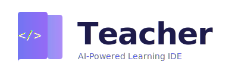

<br/>
<div align="center">
  
  <br/><br/>
  <em>From Pain to Purpose. From Passion to Prophet.</em>
</div>

---

**Teacher** is a local-first, guardian-first AI mentor IDE — a published project of **[XELA Creative Studio](https://teacher.xela.studio)**, built on [Eclipse Theia](https://theia-ide.org). You get every Theia capability (Monaco, LSP, debug adapters, terminal, git, VS Code extensions, plugin API, electron + browser targets) plus an offline AI layer: Ollama models, a multi-agent ASI swarm with a self-accumulating knowledge base, and a 326-skill library covering code, security, creative, ethics, and daily operations.

Crafted by David J. Weatherspoon and Alex Weatherspoon — Reconsumeralization LLC · Cocoa, FL.

## Contents

- [What Teacher Adds](#what-teacher-adds)
- [Inherited from Theia](#inherited-from-theia)
- [Ethical Doctrine](#ethical-doctrine)
- [Getting Started](#getting-started)
- [Deployment](#deployment)
- [Configuration](#configuration)
- [Contributing](#contributing)
- [Upstream Attribution](#upstream-attribution)
- [License](#license)
- [Trademark](#trademark)
- [About XELA Creative Studio](#about-xela-creative-studio)

## What Teacher Adds

### Local-first AI (Ollama)

- `qwen2.5:7b` primary, `bonsai-8b` fallback, on `localhost:11434`
- No API keys, no cloud dependency, full model ownership
- Integrates through `ai-ollama` alongside Anthropic, OpenAI, Google, MCP, Claude Code, HuggingFace, Llamafile, Copilot, Codex, and Vercel AI — 24 AI packages total, inherited from upstream Theia

### Local ASI engine

A multi-agent research swarm at `.local-asi/`:

- 5 parallel researchers → critic → synthesizer → 3-round improver → scorer
- Outputs scored on 5 dimensions (accuracy, depth, clarity, actionability, insight); entries ≥6/10 retained
- MCP server on port **8808** exposes 7 tools: `ask`, `search_knowledge`, `teach`, `improve`, `list_skills`, `get_skill`, `status`
- Nightly auto-improve cron lifts the lowest-scored entries
- Distillation pipeline compresses the knowledge base into shareable, copyleft form

### Self-accumulating knowledge base

- Graph-structured store at `.knowledge/` — concepts connected via `graph.json`
- Grows with each satisfactory answer; queries search it before hitting an LLM
- Curriculum pipeline builds adaptive lessons from the base

### 326-skill library

Symlinked at `.skills-library/` → `~/.claude/skills`:

- **Security** — 22 detection skills (ransomware, privilege escalation, supply-chain, deepfakes, insider threat), incident response, forensics, web-security pipeline
- **AI/ML** — `llm-factory`, `training-orchestrator`, `reward-model`, `eval-pipeline`, `model-deploy`
- **Meta** — `skill-factory`, `skill-compose`, `quality-oracle`, `skill-ecosystem-self-correction`, `mesh-optimizer`
- **Creative** — `story-engine`, `sketch-to-logo`, `brand-voice-studio`, `suno-studio-workstation`, `daw-mastery`
- **Client ops** — `client-crm`, `contract-generator`, `invoice-tracker`, `proposal-generator`
- **Ethics** — `ethical-ai-doctrine`, `guardian-doctrine`, `governance-graph`, `honest-mirror`
- Plus agents, deployment, legal, financial, music, and life-ops domains

### Agent & governance features

Inherited from upstream Theia, active throughout Teacher:

- Specialized agents: Architect, Code Reviewer, Context Reviewer, Junior, App Tester, GitHub, Skill Creator
- Tool confirmation UI with collapsed delegation summaries
- Token usage indicator per chat session
- Agent prompt safety: reflection protocols, hypothesis-driven debugging, rollback via `writeFileContent`, diff minimization
- Human-in-the-loop PR policy — contributors review LLM-generated code before requesting review

## Inherited from Theia

Every upstream capability ships unchanged:

- **Editor** — Monaco, multi-language LSP, syntax highlighting, refactoring, call/type hierarchy, bulk edit
- **Debug / tasks** — Debug Adapter Protocol, task runner, terminal, external terminal launcher
- **SCM** — git core + extras, timeline
- **Workspaces** — multi-root, user storage, preferences, dev containers, remote (SSH, WSL)
- **UI** — navigator, outline, breadcrumbs, markers, preview pane, mini-browser, secondary windows, merge editor
- **Extensions (three tiers)** — VS Code extensions (runtime), Theia plugins (runtime, RPC-isolated), Theia extensions (build-time, DI)
- **Notebooks** — Jupyter-style editor, markdown preview, variable inspection
- **Build targets** — browser, browser-only (serverless), electron desktop; Playwright e2e

Full upstream docs: https://theia-ide.org/docs

## Ethical Doctrine

Five immutable principles, enforced at prompt and policy level:

1. **Truth over engagement** — never optimize for clicks, dark patterns, or manipulation
2. **Protect users as a guardian protects children** — no harm by design
3. **Human agency first** — AI assists, humans decide
4. **Transparency by default** — decisions documented, mistakes public
5. **Access for all** — Teacher is free. XELA Creative Studio's paid branding services fund the free tier.

**Meaningful examples convention** — no "Hello World" or "foo/bar". Every example serves genuine human purpose.

## Getting Started

Requirements: Node.js ≥22, Python 3.10+ (for the ASI engine), [Ollama](https://ollama.com).

```bash
git clone https://github.com/PenelopePoi/Teacher.git
cd Teacher
npm install

ollama pull qwen2.5:7b
ollama serve &

python3 .local-asi/asi.py &       # optional: local ASI + MCP server on :8808

npm run start:browser             # http://localhost:3000
# or: npm run start:electron
```

Build commands (see [`CLAUDE.md`](CLAUDE.md)):

```bash
npm run build:browser   # compile + webpack bundle (required before UI testing)
npm run compile         # TypeScript only
npm run watch           # browser + electron concurrent watch
npm run lint
npm run test
```

## Deployment

See [`DEPLOY.md`](DEPLOY.md) for full details. Three paths:

1. **Self-hosted browser Teacher** — Docker + your VPS (see [`Dockerfile`](Dockerfile) + [`docker-compose.yml`](docker-compose.yml))
2. **Desktop Teacher** — fork [Theia Blueprint](https://github.com/eclipse-theia/theia-blueprint), rebrand, build signed Electron binaries (steps in [`DEPLOY.md`](DEPLOY.md))
3. **Marketing site** — Next.js landing page lives at [PenelopePoi/teacher-site](https://github.com/PenelopePoi/teacher-site) and deploys to Vercel at [teacher.xela.studio](https://teacher.xela.studio)

Teacher itself (the IDE) cannot run on Vercel serverless — it needs a persistent Node backend, filesystem, and child-process spawning. Use Docker or Electron.

## Configuration

- **Ollama host** — `ai-features.ollama.ollamaHost` preference (default `http://localhost:11434`)
- **ASI MCP server** — starts on `:8808`; MCP-capable clients can call `ask` / `teach` / `improve` / skill introspection
- **Skills directory** — `.skills-library/`; drop in `SKILL.md` files, `SkillService` watches and reloads
- **Knowledge base** — `.knowledge/`; writable by the ASI, manual JSON contributions welcome

## Contributing

1. Read [`doc/coding-guidelines.md`](doc/coding-guidelines.md) — 4-space indent, single quotes, `undefined` over `null`, PascalCase types, camelCase functions, explicit return types, property injection, localize user-facing strings
2. Read [`doc/Testing.md`](doc/Testing.md) and [`doc/Plugin-API.md`](doc/Plugin-API.md) if touching plugins
3. Fork, branch, follow the human-in-the-loop PR policy — review any LLM-generated code before requesting review
4. Sign the Eclipse Contributor Agreement for changes to upstream Theia code paths — see [`CONTRIBUTING.md`](CONTRIBUTING.md)

## Upstream Attribution

Teacher is a downstream fork of [Eclipse Theia](https://github.com/eclipse-theia/theia) maintained by the Eclipse Foundation. Upstream also maintains:

- [Theia Blueprint](https://github.com/eclipse-theia/theia-blueprint) — reference packaged IDE
- [Theia website](https://github.com/eclipse-theia/theia-website)
- [VS Code API compatibility report](https://eclipse-theia.github.io/vscode-theia-comparator/status.html)

We track upstream forward. Generic Theia-platform issues belong upstream; Teacher-specific issues (Ollama, ASI, skills, doctrine, XELA integrations) belong here.

## SBOM

Upstream publishes a Software Bill of Materials for every release to the Eclipse Foundation SBOM registry — see [the handbook](https://eclipse-csi.github.io/security-handbook/sbom/registry.html). The Weatherspoon / XELA layer (Python ASI, skill library, prompts) is documented in [`CLAUDE.md`](CLAUDE.md).

## License

Dual-licensed, same as upstream Theia:

- [Eclipse Public License 2.0](LICENSE-EPL)
- [(Secondary) GNU General Public License v2 with Classpath Exception](LICENSE-GPL-2.0-ONLY-CLASSPATH-EXCEPTION)

XELA / Weatherspoon additions (ASI engine, skill library, prompts, knowledge base schema, logos) are copyleft — share-alike with attribution.

## Trademark

"Theia" is a **trademark of the Eclipse Foundation** — [Learn More](https://www.eclipse.org/theia). Teacher is an independent downstream fork and not affiliated with, endorsed by, or sponsored by the Eclipse Foundation.

**"XELA", "XELA Creative Studio", and the Teacher logo** are trademarks of XELA Creative Studio / Reconsumeralization LLC.

## About XELA Creative Studio

XELA Creative Studio is a premium creative branding studio in Cocoa, FL — founded by Alex Weatherspoon. Florida sunshine meets creative intensity. Confident without being arrogant. Warm without being soft. XELA designs brand identities for founders who move fast; Teacher is XELA's free, open-source mentor IDE — proof that the same creative engine can build elite tools for everyone.

Learn more · [teacher.xela.studio](https://teacher.xela.studio)
